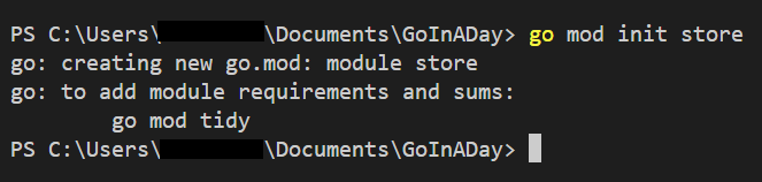
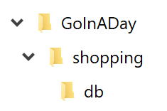
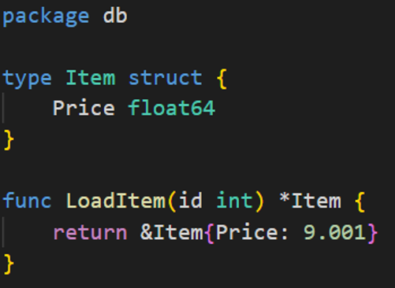
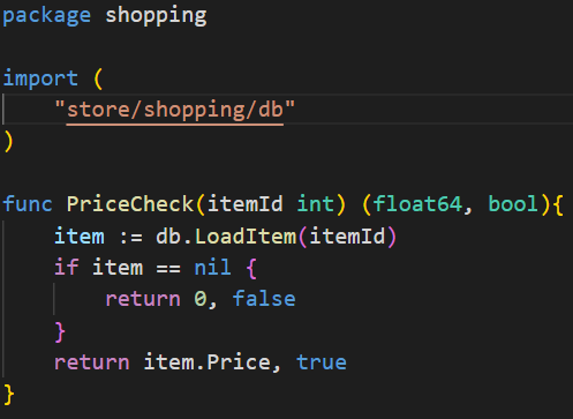
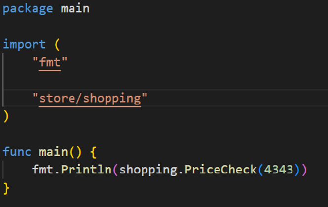
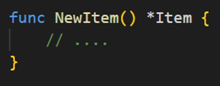
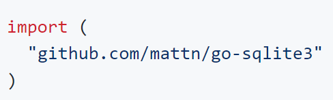

# Go Packages

To keep more complicated libraries and systems organized, we need to learn about packages. 

A note on ```go mod``` and its history – sometimes you’ll look up things about Go and it’ll tell you all about ```GOPATH``` or ```GOROOT```. This applies to older versions of Go.

For our purposes we’ve ignored it and are only using modules. And we have used ```go mod init <project_name>``` when we create a new project.

When you do this, you will have a ```go.mod``` file in your root which is like ```package.json``` in Node – it’s really a list of all your packages and where you get them. Maven, Nuget – all similar things.

## Setting up

1. Create a new folder (I’ve used GoInADay in my documents folder)
2. Open this folder up via VS Code
3. Open a new Terminal and run ```go mod init store```



In the ```store``` directory, open the ``go.mod`` file using nano, or your favorite text editor.

The first line, the module directive, tells Go the name of your module so that when it’s looking at import paths in a package, it knows not to look elsewhere for store. The store value comes from the parameter you passed to go mod init

This will become very important shortly about how Go finds its packages…

## Create A DB Package

Create a new folder under your base folder (for me, GoInADay, referenced as the module store in go.mod) called shopping and a subfolder within it called db.



Inside of ```shopping/db```, create a file called ```db.go``` and add the following code:



In Go, package names follow the directory structure of your Go workspace. If we were building a shopping system, we'd probably start with a package name "shopping" and put our source files in ```/shopping/```.

We don't want to put everything inside this folder though. For example, maybe we want to isolate some database logic inside its own folder. To achieve this, we create a subfolder at ```/shopping/db```. The package name of the files within this subfolder is simply ``db``, but to access it from another package, including the shopping package, we need to import ```shopping/db```.

In other words, when you name a package, via the package keyword, you provide a single value, not a complete hierarchy (e.g., "shopping" or "db"). When you import a package, you specify the complete path.

Notice that the name of the package is the same as the name of the folder. Also, obviously, we aren't actually accessing the database. We're just using this as an example to show how to organize code.

## Create A Shopping Package

Now, create a file called ```pricecheck.go``` inside of the main shopping folder and add the following code:



You’ll see here that we need to refer to the fully-qualified path from the module root (GoInADay folder which we named ```store``` when we did ```go mod init```) up to the db package. This is what you have to remember about modules!

It's tempting to think that importing ```shopping/db``` is somehow special because we're inside the shopping package/folder already. In reality, you're importing ```store/shopping/db```, which means you could just as easily import test/db so long as you had a package named db inside of your workspace’s modulename/test folder.

The format for this import is always ```modulename/folderpath```.

## We Need A Main

If you're building a package, you don't need anything more than what we've seen. To build an executable, you still need a ```main```. I added mine to the root, but other prefer to create a folder – for instance named shopping – and put it in there.

Wherever you put it, add this code to it:



You can now run your code by going into your shopping project and typing:

```go run main/main.go```

## Visibility - How Go Handles Public vs Private

Go uses a simple rule to define what types and functions are visible outside of a package. If the name of the type or function starts with an uppercase letter, it's visible. If it starts with a lowercase letter, it isn’t.

This also applies to structure fields. If a structure field name starts with a lowercase letter, only code within the same package will be able to access them.

> lowercase = package private
> 
> Uppercase = public

For example, if our ```db.go``` file had a function that looked like:



it could be called via ```db.NewItem()```. But if the function was named ```newItem```, we wouldn't be able to access it from a different package.

> Go ahead and change the name of the various functions, types and fields from the shopping code. For example, if you rename the Item's Price field to price, you should get an error.

## Package Management

The go command we've been using to run and build has a get subcommand which is used to fetch third-party libraries. ```go get``` supports various protocols but for this example, we'll be getting a library from Github.

From a shell/command prompt, enter:
- ```go get github.com/mattn/go-sqlite3``` 


```go get``` fetches the remote files and stores them in your workspace. 

In addition to the shopping project that we created, you'll now see a ```github.com``` folder. Within, you'll see a ```mattn``` folder which contains a go-sqlite3 folder.

We just talked about how to import packages that live in our workspace. To use our newly gotten go-sqlite3 package, we'd import it like so:



I know this looks like a URL but in reality, it'll simply import the go-sqlite3 package which it expects to find in ```$module/github.com/mattn/go-sqlite3.```

## go mod tidy

This command will basically match the ```go.mod``` file with the dependencies required in the source files. It will:

1. Download all the dependencies that are required in your source files and update go.mod file with that dependency.

2. Remove all dependencies from the ```go.mod``` file which are not required in the source files.

When you clone a new Go project that has dependencies, you will need to run ```go tidy``` to download these dependencies. If you have used Node before, it's like having to run ```npm -i```.


